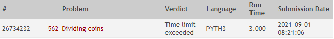
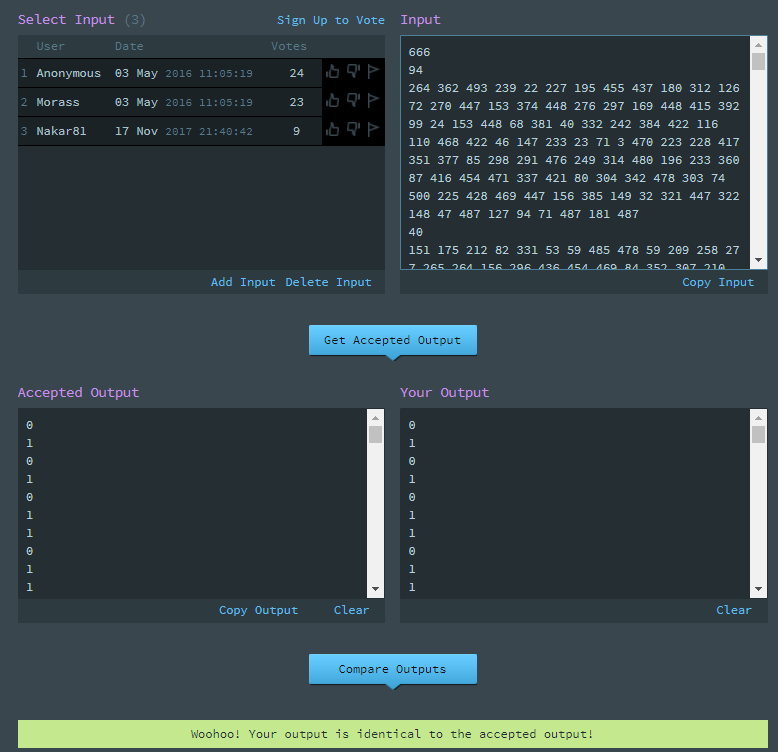

# Trabalho de Programação
**Dividir e Conquistar & Programação Dinâmica & Algoritmos Gulosos**
**Autor:** Alexandre Jastrow Da Cruz
**Data:** 01 de setembro de 2021
**Problema:** 00562 -- Dividing coins

## Sobre a Solução
Este diretório contém o código fonte gerado para solucionar o problema 00562
do *Online Judge*. O problema recebeu veredito “Time limit exceeded”, como mostrado na
figura abaixo: 

O programa foi desenvolvido em PYTH3 3.5.1 - Python 3

O programa nao execultou no tempo delimitado pelo *Online Judge*, porem a resposta de saida do programa esta correta e confirmada pelo *uDebug*, como é possivel verificar na figura abaixo:

