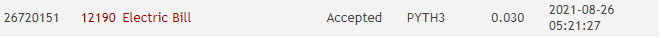

# Trabalho de Programação
**Dividir e Conquistar & Programação Dinâmica & Algoritmos Gulosos**
**Autor:** Alexandre Jastrow Da Cruz
**Data:** 26 de agosto de 2021
**Problema:** 12190 -- Electric Bill

## Sobre a Solução
Este diretório contém o código fonte gerado para solucionar o problema 12190
do *Online Judge*. O problema recebeu veredito “Accepted”, como mostrado na
figura abaixo:

O programa foi desenvolvido em PYTH3 3.5.1 - Python 3
